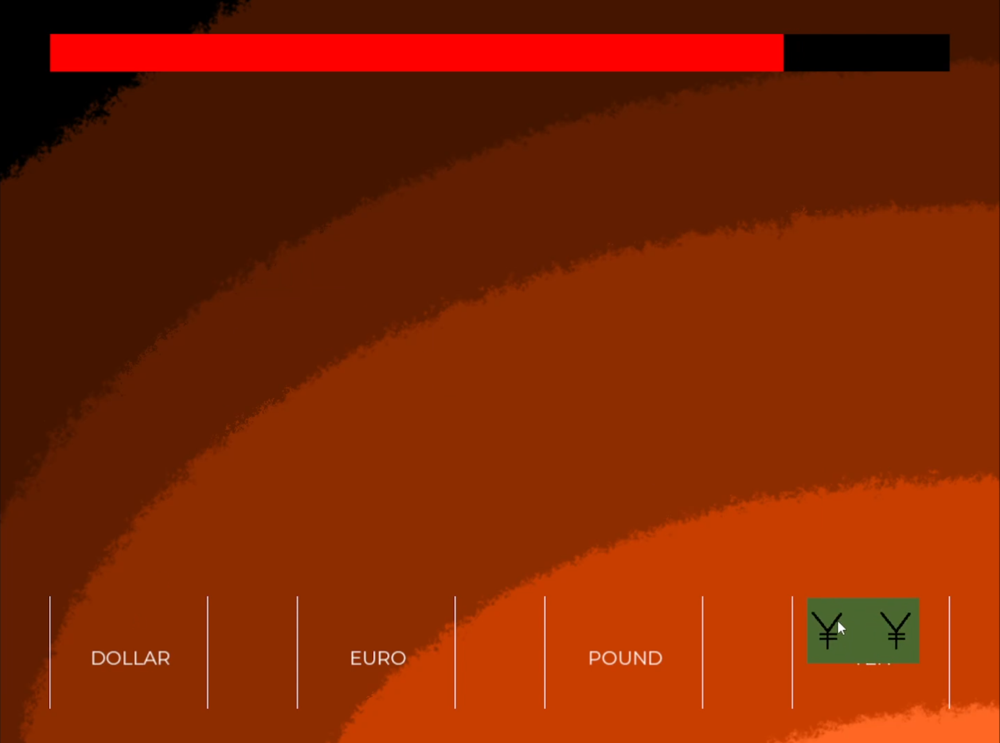
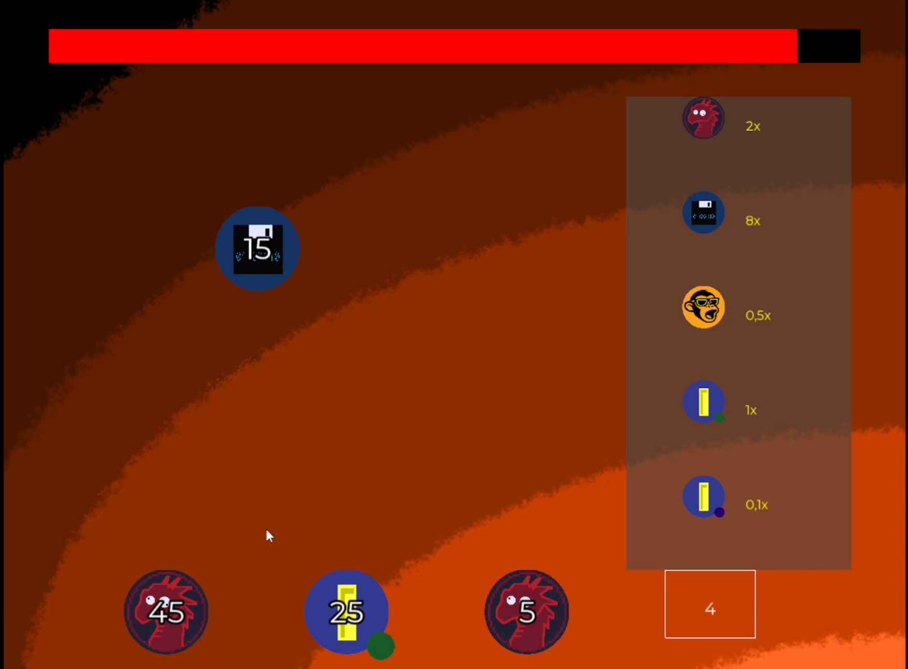
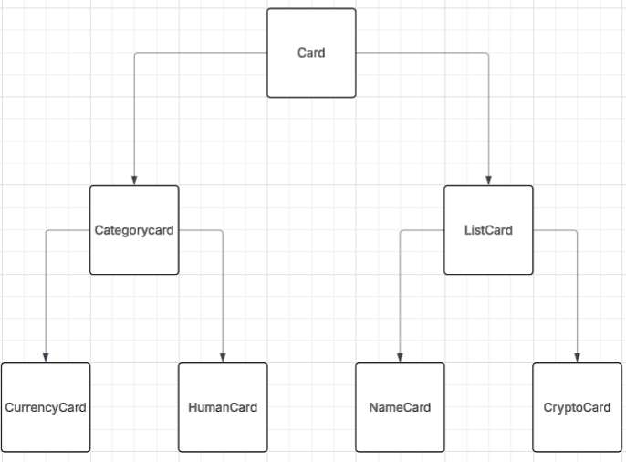

[<--- Back to main Page](./index.md)
# A.P.E
A.P.E is a 2D sorting game built in C# with SFML, created as my first full game project at university. I focused on system architecture, card interaction logic, and the development of a reliable drag-and-drop framework for multiple item types. This project is significant because it demonstrates my early approach to structuring gameplay systems, solving UI/logic challenges, and organizing a multi-week development pipeline.

# Challenges
## Technical Challenges
- Designing a flexible state system (`TableManager`) that coordinates menu, dialogue, gameplay, and fail states.  

- Implementing two different game modes (Category and List), each requiring unique evaluation logic while sharing core mechanics.  

- Building a dynamic container layout that adapts to different card types and container counts without breaking UI clarity.  

- Creating a unified card architecture that supports four card types (Currency, Name, Crypto, Human) with shared behavior and custom logic.  

- Parsing custom deck files with a JSON-like structure and interpreting them differently depending on the card type.  

- Ensuring consistent drag-and-drop interaction across all card types using interface-driven design.  

## Production & Workflow Challenges
- Finding the right balance between planning and execution during a multi-week project.  

- Maintaining motivation when milestones were too large and provided no short-term feedback.  

- Structuring development progress while managing university workload.

---

# Solutions
## Technical solutions
- Implemented a central state controller (`TableManager`) to manage the full game flow, including menu, dialogue, gameplay and lose states, as well as timer, mistake tracking and music transitions.

- Separated gameplay logic into two main game modes (**Category** and **List**), allowing different evaluation rules while reusing the same core systems for input, feedback and flow control. 

- Designed a layered card architecture with a shared abstract `Card` base, two intermediate types (`CategoryCard`, `ListCard`) and four concrete card types (`Currency`, `Name`, `Crypto`, `Human`), keeping behavior consistent while still allowing specialized logic. 

- Built a `DeckManager` that reads custom deck files, parses them depending on card type, creates and shuffles decks, and evaluates player actions on each placement instead of at the very end of a round – based on feedback from a code review. *(More context in the [Lessons Learned](#lessons-learned) section.)*  

- Created a flexible deck file format (JSON-like key–value structure) that allows designers to define duration, card types, crypto definitions and human data without touching code.  

- Implemented a unified drag-and-drop system using an `IDraggable` interface and a dedicated `DragManager`, so all card types interact with containers in the same way. 

- Developed a dynamic container layout system that automatically arranges containers based on their number (single row, multi-row) to keep the UI readable across different level configurations.  

- Added a data-driven dialogue system for the CEO character, where expressions, text and voice pitch are defined in external text files and processed line by line. 

## Workflow & process solutions
- Created a multi-week project timeline and adjusted it based on real progress, which helped maintain a clear overview of what was done and what still needed work. 

- Used sketches and planning documents to define class responsibilities and function behavior early, reducing the need for large refactors later on.   

- Switched from large, vague milestones to smaller, concrete tasks to keep motivation and visible progress high throughout the project.  

- Kept development history structured through regular Git commits with descriptive messages, making it easy to track changes and future improvements.  

---

# Screenshots

*Basic gameplay loop with static containers and simple card sorting. Shows the core interaction and timing pressure.*  

*Advanced card type with dynamic containers and data-driven evaluation using coin value factors defined in the deck file.*  

*Simplified architecture showing the layered card system (base class -> mode-specific classes -> concrete card types).*

---

# Lessons Learned
- Initially, I used a separate “correct deck” structure to evaluate list-based levels. After a code review, I refactored this into an incremental evaluation on each placement, which reduced duplicated state and simplified the overall logic.  

- Planning only gets you so far — at some point, implementation needs to take over. I learned how to find a healthy balance between design, architecture thinking and simply writing code.  

- Large milestones can kill momentum. Breaking tasks into smaller, achievable steps kept motivation and visible progress steady throughout the project.  

- Clear class responsibilities and early sketches prevent late-stage refactoring and unnecessary complexity.  

- Consistent project documentation (structure diagrams, behavior notes, deck format) made debugging and feature expansion much easier.  

- Regular Git commits with meaningful messages created a reliable development history and made iteration far simpler.  

- Managing workload from university and a multi-week project taught me how to prioritize realistically and maintain progress even under pressure.  

