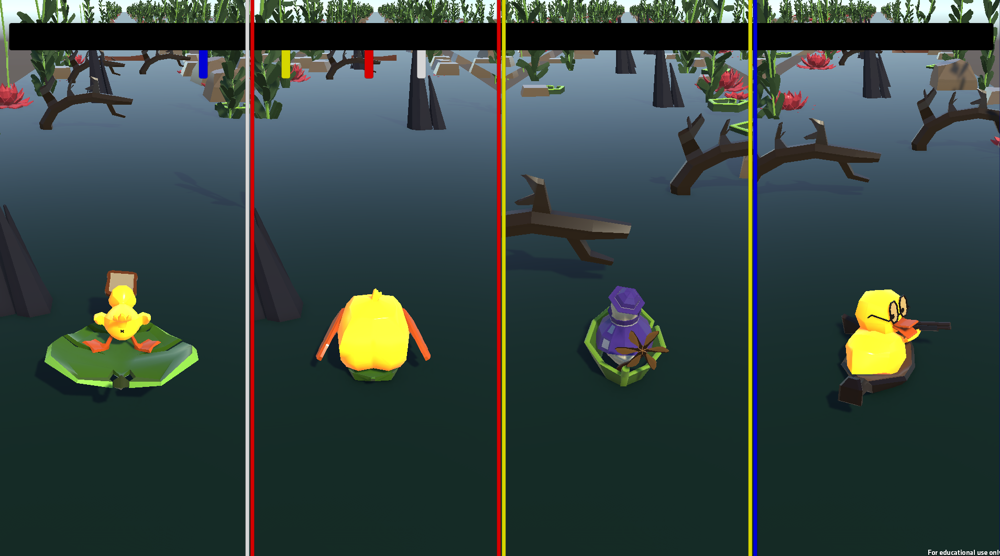

[<- Back to main Page](./index.md)
# Duck You
Duck You is a local multiplayer GameJam project built around a fast-paced endless runner concept for up to four players on a single couch.  
I worked as the sole programmer in a small team of artists, focusing on building a reusable player architecture that allowed four independent characters to run simultaneously with shared logic but individual input mappings and camera setups.  
The main technical challenge was handling four controllers reliably in Unity while keeping the gameplay responsive and scalable.

---

# Challenges

- Designing a four-player endless runner where all players share the same lane logic without interfering with each other’s movement or obstacles.  

- Creating a reusable obstacle and lane system that could continuously generate new segments while keeping gameplay readable and fair.  

- Implementing reliable four-player local multiplayer with individual controllers, which turned out to be more complex than initially expected.  

- Balancing difficulty over time by increasing player speed while avoiding constant overload through obstacle placement.


---

# Solutions

- Built the track around reusable lane-based segment prefabs, each defining three fixed movement positions shared by players and obstacles to prevent overlap between players.  

- Implemented a queue-based segment system that dequeues passed segments and enqueues new random ones, with weighted chances to spawn empty segments for better pacing.  

- Used prefab variants to apply the same segment logic to all four players while keeping independent cameras, inputs and UI boundaries.  

- Added a speed system that gradually increases challenge over time while slowing players down on collisions, allowing recovery and maintaining flow.  

- Introduced color-coded UI borders around each player’s screen area to clearly separate players and communicate position and ownership in a shared screen space.

- Solved the controller setup by working through Unity’s documentation and systematically debugging the input setup until each player could be reliably mapped to a separate controller.  

---

# Screenshot

*Core four-player endless runner view with shared lane layout and color-coded borders for each player.* 

---

# Code Snippets

## ObstacleMaster
```Csharp
void Update()
{
    if (obstacleQueue.Peek() == null)
    {
        obstacleQueue.Dequeue();

        GameObject randomObstacle = obstaclesPrefabs[Random.Range(0, obstaclesPrefabs.Count)];
        obstacleQueue.Enqueue(randomObstacle);
    }

    foreach (GameObject obstacle in obstacleQueue)
    {
        if (obstacle == null) continue;
        obstacle.transform.position += Vector3.back * speed * Time.deltaTime;
    }

    if(speed < maxSpeed)
        speed += acceleration * Time.deltaTime;
}
```
*Core obstacle loop: recycles obstacles through a queue, respawns new ones as old segemnts pass, and ramps up speed over time to increase pressure.*  

---

# Lessons Learned

- Local multiplayer systems can introduce significantly more complexity than expected, especially regarding input handling.  

- Early testing of core systems like controller setup is crucial to avoid costly surprises late in development.  

- Using a queue-based system for obstacles and segments works very well for endless runners, making it straightforward to recycle content and control pacing over time.  

- Using a base prefab with variations allowed global changes to propagate instantly across all players and obstacles, making iteration, testing and tuning significantly faster during development.  

- Reading documentation and experimenting through debugging helped turn a misunderstood system into a working solution.


