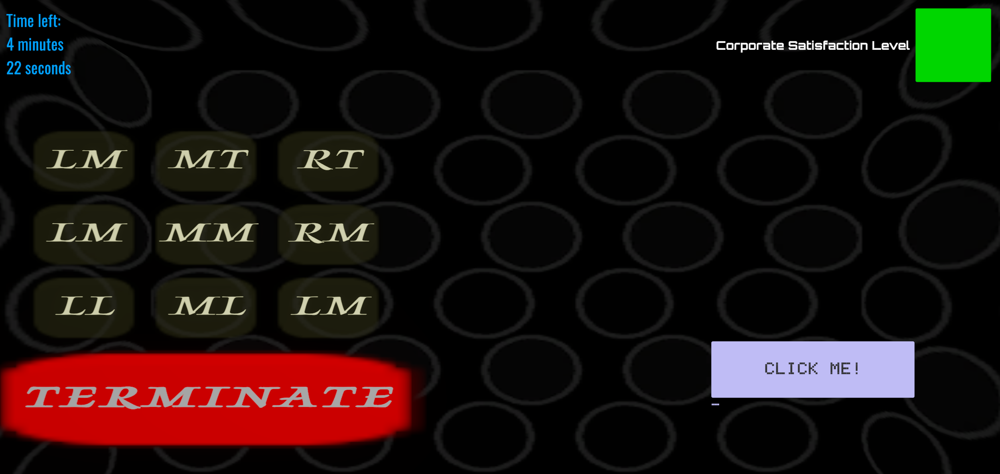
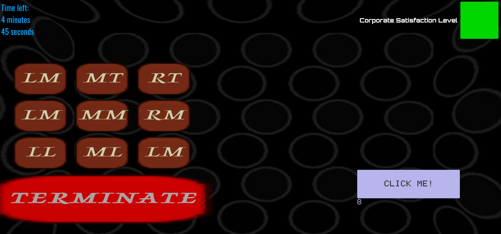

[<--- Back to main Page](./index.md)
# Last Response
Last Response is a solo GameJam project made in Unity for the theme **“Lost Signal.”**  
The player monitors nine rooms through a phone system, listening to ambient sounds and deciding whether each room is safe or needs to be terminated. Different enemy types affect the soundscape in unique ways, from simple threats that emit periodic noises to a chainsaw enemy that drowns out other signals and a “faker” that mimics room responses through pitch changes.  
I focused on the enemy behavior logic, the room and state management, and the UI that lets the player quickly read room status and trigger termination under time pressure.

---

# Challenges

- Designing a room system for nine rooms that could track different room conditions (normal operation, active threats and terminated rooms) while still being easy to control from code.  

- Implementing multiple enemy types with distinct behavior patterns (periodic threats, constant noise, fake responses) that all interact with the same room system.  

- Making sure enemies never occupied the same room at the same time while still feeling random and unpredictable.  

- Building a UI that clearly represented all nine rooms, including a “termination mode” that changed button colors and states to show which rooms were shut down.  

- Creating an audio-driven experience where the player relies on sound direction, timing and pitch changes to read threats without the game becoming unreadable noise.

---

# Solutions

- Used a `RoomManager` with a simple `RoomState` enum and event to broadcast which of the nine rooms is currently being called, so individual room scripts could react without tightly coupling everything together.  

- Implemented a `RoomLogic` script for each room that listens to room state changes, schedules when its phone should ring, and controls audio playback and a low-pass filter to create the “telephone” effect.  

- Used a `RoomInfos` ScriptableObject as a central data store for all room positions and attack states, so enemies and room logic could share consistent information without tightly coupling everything together.  

- Exposed a `RoomRespondsRequest` flag with an event, allowing UI and logic to react whenever a room stopped responding normally (for example when under attack or affected by the “faker” enemy).

- Structured the UI around nine room buttons wired to room scripts, plus a termination mode that visually changes button states when a room is shut down, giving clear feedback under time pressure.

---
# Screenshots

*Normal gameplay state: calling rooms and reading responses through audio and UI feedback.*  


*Termination mode with changed button states*

---

# Code Snippets

## RoomManager
```Csharp
public class RoomManager : MonoBehaviour
{
   public enum RoomState
    {
        None,
        LT, MT, RT,
        LM, MM, RM,
        LL, ML, RL
    }

    //...

    public event Action<RoomState> OnRoomStateChanged;
    

    public void SetRoomState(RoomState newState)
    {
        OnRoomStateChanged?.Invoke(currentState);
    }
}
```
*Broadcast-based room focus system using an enum and event so individual room scripts can react without tight coupling.*  

## RoomLogic - OnRoomChange
```Csharp
void OnRoomChange(RoomManager.RoomState activeRoom)
{
    if (activeRoom != roomId)
        return;

    lastTime = Time.time;
    allowedToSpeak = true;
    delay = Random.Range(3f, 7f);

    if (roomInfo.AttackedRooms[roomId])
    {
        allowedToSpeak = false;
        if (!FakersScript.active)
            roomInfo.RoomRespondsReqeust = false;
    }
}
```
*Per-room behavior reacting to focus changes, scheduling phone responses and altering behavior when rooms are under attack or faked.*  

# Lessons Learned

- Event-based communication made it much easier to coordinate room behavior without tightly coupling individual scripts, especially under GameJam time constraints.  

- Audio as the primary information channel requires very clear rules and strong UI feedback, otherwise players can easily feel overwhelmed or confused.  

- Keeping room logic local and reactive allowed enemy behaviors to reuse the same systems while still feeling distinct.  

- Rapid prototyping during a GameJam often leads to messy code, but identifying the core systems early helped keep the project stable until the end.
