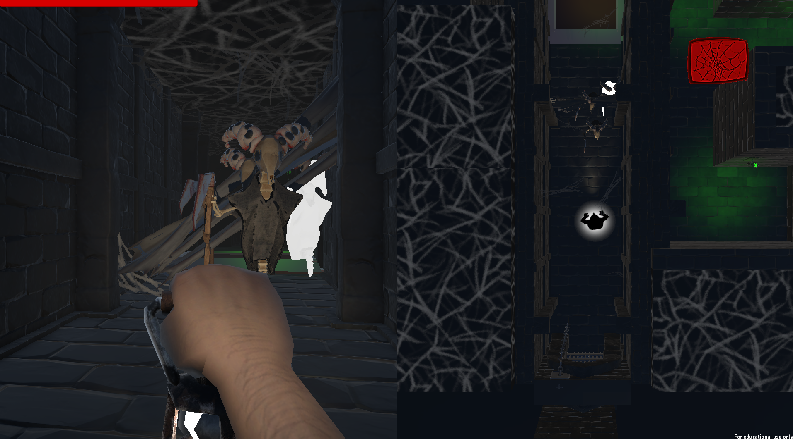
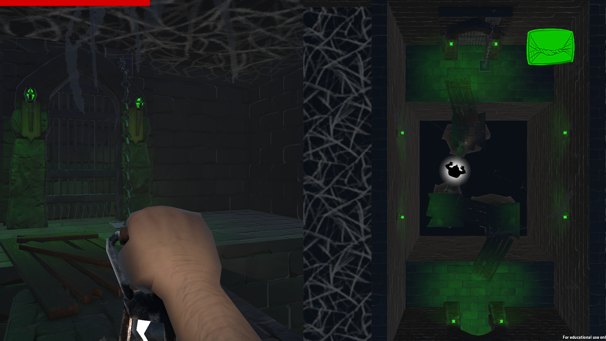

[<- Back to main Page](./index.md)
# Spider MOMmy
SpiderMOMmy is an asymmetric cooperative GameJam project where one player controls a first-person adventurer while the second player plays a top-down spider supporting and protecting them from above.  
I acted as the main game designer and technical coordinator, defining the core mechanics, enemy behavior and cooperative systems, while also guiding a mixed-experience programming team during development.

---

# Challenges
- Designing asymmetric cooperative gameplay where both players feel essential despite having very different abilities and perspectives.  

- Creating spider web mechanics that support the adventurer without direct combat, while remaining readable and fair for both players.  

- Coordinating development across programmers with very different experience levels while keeping progress stable under GameJam time pressure.  

- Designing enemy systems that interact differently with the adventurer and the spider’s web structures, such as being slowed or damaged while continuing to directly pursue the player.

---

# Solutions

- Defined clear roles early on: the adventurer focuses on movement, interaction and survival, while the spider acts as the primary combat and area-control role.  

- Designed spider web systems with distinct behavior (damage walls vs. traversal webs), including raycast checks to prevent invalid placements and overlapping structures.  

- Used NavMesh-based enemy movement to ensure enemies could navigate the environment reliably while directly pursuing the adventurer, allowing spider webs to influence combat flow through slowing and damage.   

- Provided clear explanations of the intended mechanics and boundaries of each system, allowing other programmers to implement features independently without breaking the overall gameplay vision.  

---

# Screenshot

*Asymmetric split-screen gameplay showing the adventurer’s first-person view and the spider’s top-down support perspective.*

*Spider-created web bridge enabling traversal, highlighting the support-focused cooperation between both players.*

---

# Lessons Learned

- Clear communication of ideas is crucial when working with mixed-experience teams; abstract mechanics became much easier to implement once they were explained using simple sketches and pen-and-paper diagrams.  

- Learning when to simplify or defer architectural ideas under heavy time pressure is essential to keep a GameJam project moving forward.  

- Raycasting proved to be a versatile and reliable tool, used across multiple systems such as spider web placement and player interaction detection.  

- Using simple telegraphed attacks with separate detection and damage triggers made enemy behavior feel fair and readable without requiring complex AI.  

- Working with NavMesh for the first time highlighted the importance of robust navigation systems, even for otherwise simple enemy behaviors.

